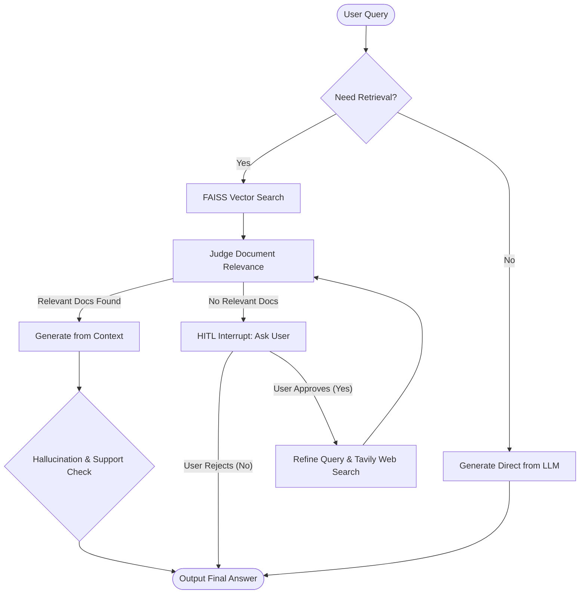

***

```markdown
# 🧠 Advanced Self-RAG System with LangGraph & HITL

[](https://www.python.org/)
[](https://github.com/langchain-ai/langgraph)
[](https://python.langchain.com/)
[](https://groq.com/)
[](https://github.com/facebookresearch/faiss)
[](LICENSE)

An intelligent, self-reflective, agentic **Self-RAG (Self-Reflective Retrieval-Augmented Generation)** pipeline powered by **LangGraph**, **Groq**, **FAISS**, and **Tavily Web Search**. 

Unlike standard linear RAG pipelines, this system dynamically decides whether external knowledge is necessary, filters out irrelevant or noisy context, verifies hallucination and answer faithfulness, gracefully falls back to web search with query refinement, and features a stateful **Human-in-the-Loop (HITL)** approval mechanism.

---

## 📑 Table of Contents

- [Overview](#-overview)
- [Key Features](#-key-features)
- [System Architecture & Flow](#-system-architecture--flow)
- [Pipeline Execution Breakdown](#-pipeline-execution-breakdown)
- [Tech Stack & Libraries](#-tech-stack--libraries)
- [Project Structure](#-project-structure)
- [Installation & Setup](#-installation--setup)
- [Environment Variables](#-environment-variables)
- [Usage Guide](#-usage-guide)
- [Evaluation & Self-Reflection Metrics](#-evaluation--self-reflection-metrics)
- [Contributing](#-contributing)
- [License](#-license)

---

## 🔍 Overview

Traditional RAG systems blindly retrieve documents for every query and feed them directly to an LLM, leading to several critical failure modes:
1. **Unnecessary retrieval** for trivial or general queries.
2. **Context contamination** from low-similarity or irrelevant chunks.
3. **Hallucinations** when retrieved context is insufficient or ungrounded.
4. **Knowledge boundaries** when the vector store lacks the required domain data.

This project implements **Self-RAG** using a cyclic **StateGraph** that incorporates self-correction, relevance grading, hallucination detection, autonomous query refinement, and human interaction.

---

## ✨ Key Features

- **Dynamic Retrieval Routing:** Evaluates user questions to decide if local document retrieval is required or if parametric LLM knowledge suffices.
- **Document Relevance Grading:** Automatically grades retrieved vector chunks against the question using structured Pydantic outputs, pruning out false positives.
- **Self-Reflective Answer Assessment:**
  - **Support Validation:** Checks if the generated answer is `fully_supported`, `partially_supported`, or `no_supported`.
  - **Hallucination Detection:** Flagging ungrounded facts using boolean indicators (`is_hallucinating`).
- **Autonomous Query Refinement:** Rewrites ambiguous user prompts into search-optimized queries before executing external searches.
- **Web Search Fallback:** Integrates **Tavily Search API** when local vector stores do not contain sufficient information.
- **Human-in-the-Loop (HITL) Interrupts:** Pauses the execution graph using LangGraph's `interrupt()` and `MemorySaver()` checkpointing to prompt the user before initiating web searches.

---

## 🏗 System Architecture & Flow



---

## 🔄 Pipeline Execution Breakdown

The notebook demonstrates an evolutionary step-by-step construction of the graph:

### 1. Document Ingestion & Vector Indexing
- Documents in `./documents/` are loaded using `UnstructuredLoader` with a `by_title` chunking strategy.
- Chunks are split using `RecursiveCharacterTextSplitter(chunk_size=900, chunk_overlap=150)`.
- Normalized vector embeddings are computed using `sentence-transformers/all-MiniLM-L6-v2`.
- Indexed using **FAISS** for fast similarity retrieval ($k=4$).

### 2. Retrieval Decision Node (`decide_retrieval`)
Determines if answering requires specific factual context or citations:
- Returns structured output: `retrievalDecision(decision: bool)`.
- **False:** Routes directly to `generate_direct`.
- **True:** Routes to `retrieve`.

### 3. Document Relevance Grader (`is_relevant`)
Iterates over retrieved documents to ensure alignment with the question:
- Uses `judgeDocs(is_relevant: bool)` schema to eliminate irrelevant documents.
- If relevant documents exist, routes to `generate_from_context`.
- If no documents are relevant, routes to `no_relevant_docs`.

### 4. Hallucination & Sufficiency Check (`is_suff`)
Supervises the generated context-grounded response:
- Output Schema:
  - `answer`: `Literal['fully_supported', 'partially_supported', 'no_supported']`
  - `is_hallucinating`: `bool`

### 5. Web Search & Query Refinement (`webSearch`)
If local documents are insufficient:
- Transforms the query into a high-precision search query using `queryRefiner(refined_query: str)`.
- Queries Tavily API for top real-time search results.
- Returns new documents and routes them back into the relevance evaluator.

### 6. Human-in-the-Loop (HITL) Interruption
- Calls `interrupt("there is no relevant information... Do you want to search on web ? - yes/no")`.
- Execution halts statefully using `MemorySaver(checkpointer)`.
- The user can resume the graph using `Command(resume='yes')` or reject external retrieval.

---

## 🛠 Tech Stack & Libraries

| Category | Technology | Purpose |
| :--- | :--- | :--- |
| **Orchestration** | [LangGraph](https://github.com/langchain-ai/langgraph) | Cyclic graph state management, conditional branching & HITL |
| **LLM Engine** | [ChatGroq](https://groq.com/) | Ultra-low latency LLM inference (`openai/gpt-oss-20b`) |
| **Embeddings** | [HuggingFace](https://huggingface.co/sentence-transformers) | `sentence-transformers/all-MiniLM-L6-v2` |
| **Vector Store** | [FAISS](https://github.com/facebookresearch/faiss) | Dense vector storage and similarity retrieval |
| **Document Parsing**| [Unstructured](https://unstructured.io/) | Title-based and structure-aware chunk extraction |
| **Web Search** | [Tavily Search](https://tavily.com/) | Real-time AI-tailored web search queries |
| **Validation** | [Pydantic v2](https://docs.pydantic.dev/) | Structured LLM output parsing and schema enforcement |
| **State Persistence**| `MemorySaver` | Graph checkpointing for state restoration across interrupts |

---

## 📂 Project Structure

```bash
Advanced-Self-RAG-System/
├── documents/                     # Target knowledge base files (PDF, DOCX, TXT)
│   └── sample_docs.txt
├── Advanced RAG pipeline.ipynb   # Complete step-by-step Self-RAG LangGraph notebook
├── .env.example                  # Environment variables template
├── requirements.txt              # Project dependencies
└── README.md                     # Project documentation
```

---

## ⚙️ Installation & Setup

### 1. Clone Repository
```bash
git clone https://github.com/ajayn3300/Advanced-Self-RAG-System.git
cd Advanced-Self-RAG-System
```

### 2. Create and Activate Virtual Environment
```bash
# Using conda or venv
python -m venv venv
source venv/bin/activate  # On Windows: venv\Scripts\activate
```

### 3. Install Dependencies
```bash
pip install -r requirements.txt
```

*If creating your own environment, ensure the following core libraries are installed:*
```bash
pip install langgraph langchain langchain-groq langchain-huggingface \
            langchain-community langchain-unstructured faiss-cpu \
            pydantic tavily-python python-dotenv sentence-transformers
```

---

## 🔑 Environment Variables

Create a `.env` file in the root directory:

```env
GROQ_API_KEY=your_groq_api_key_here
TAVILY_API_KEY=your_tavily_api_key_here
```

---

## 🚀 Usage Guide

Open the notebook in Jupyter Notebook or VS Code:

```bash
jupyter notebook "Advanced RAG pipeline.ipynb"
```

### Running the Graph with Human-in-the-Loop:

```python
from langgraph.types import Command

# 1. Initialize Thread Configuration
config = {"configurable": {"thread_id": "session-001"}}

# 2. Invoke Graph with a query not present in local docs
result = app.invoke(
    {"question": "Tell me about the financial performance of NexaAI company"},
    config=config
)

# 3. Check for Human-in-the-Loop Interruption
if result.get('__interrupt__', ''):
    prompt_message = result.get('__interrupt__')[-1].value
    print("Agent Prompt:", prompt_message)
    # Output: "there is no relevant information about the query you asked. Do you want to search on web ? - yes/no"

# 4. Resume Graph with User Approval
resumed_result = app.invoke(
    Command(resume='yes'),
    config=config
)

print("Final Answer:\n", resumed_result["answer"])
```

---

## 📊 Evaluation & Self-Reflection Metrics

The graph state maintains the following self-reflection keys across execution:

| State Key | Type | Description |
| :--- | :--- | :--- |
| `need_retrieval` | `bool` | True if question requires external document retrieval |
| `relevant_docs` | `List[Document]` | Cleaned, evaluated chunks confirmed relevant to question |
| `refined_query` | `str` | Web-optimized prompt generated before querying Tavily |
| `is_supporting` | `str` | Degree of context grounding (`fully_supported`, `partially_supported`, `no_supported`) |
| `is_hallucinating`| `bool` | True if the answer asserts information not derived from context |
| `web_search` | `bool` | Indicates whether Tavily web search fallback was triggered |

---

## 🤝 Contributing

Contributions, issues, and feature requests are welcome!
1. Fork the repository.
2. Create your feature branch (`git checkout -b feature/AmazingFeature`).
3. Commit your changes (`git commit -m 'Add some AmazingFeature'`).
4. Push to the branch (`git push origin feature/AmazingFeature`).
5. Open a Pull Request.

---
